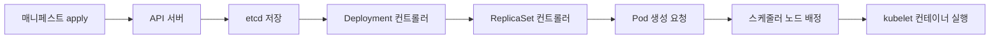
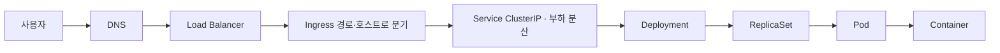

## 들어가며

SKALA L1 「쿠버네티스 이해 및 앱 배포」 1일차 기록이다. 왜 쿠버네티스를 쓰는가부터 시작해 Pod와 노드, 매니페스트와 조정 루프, 라벨 기반 트래픽 분산, 클러스터 아키텍처와 컨테이너 이미지까지 개념을 훑고, EKS 클러스터 접속 환경을 구성한 뒤 첫 배포와 `kubectl port-forward`까지 직접 실행했다.

**이 글에서 다루는 것** — 1일차 강의에서 나온 핵심 개념 요약, EKS 접속과 레지스트리 인증 준비 과정, `kubectl` 첫 배포와 port-forward 실습에서 실제로 만난 에러와 그 원인.

**다루지 않는 것** — Ingress·PVC·오토스케일 등 이후 차시에서 다룰 리소스의 실습, 그리고 이번 대화에서 원인을 끝까지 확인하지 못한 항목(맨 아래 체크리스트로 모았다).

---

## 1. 개념 요약

### 1-1. 왜 쿠버네티스인가

Docker는 컨테이너 하나를 만들고 실행하는 도구이고, 쿠버네티스(Kubernetes)는 그 컨테이너들을 여러 개·여러 노드에 걸쳐 운영하는 자동화 도구다. 재시작, 트래픽 분산, 무중단 배포, 롤백, 오토스케일이 쿠버네티스가 맡는 영역이다. 둘은 경쟁 관계가 아니라 함께 쓰는 관계다.

AWS를 쓴다고 이 문제가 사라지지는 않는다. EC2는 서버를 빌려주는 것이지 컨테이너 오케스트레이션을 대신해주지 않으므로, 오케스트레이션은 별도로 선택해야 한다. 선택지는 직접 구축(kubeadm), 관리형(EKS), ECS/Fargate 등이다.

도입 판단 기준은 명확하다. 서비스가 한두 개면 EC2에 도커만 써도 문제가 없고, 서비스 5개 이상이면서 배포가 잦을 때부터 이득이 생긴다. 팀에 아는 사람이 0명이면 PaaS를 먼저 검토하는 편이 낫다.


_그림 1. 1장 핵심요약 — 배포의 변화부터 도입 판단, EKS까지._

교재 요약표에서 이 절과 직접 연결되는 행만 옮기면 다음과 같다.

| 항목 | 한 줄 정리 | 실무 포인트 |
|---|---|---|
| 오케스트레이션 | 손으로 하던 운영 판단을 코드로 옮긴 것 | 재시작·분배·롤아웃·확장이 기본 기능 |
| 선언형 API | 원하는 상태를 적으면 컨트롤러가 맞춘다 | Pod 를 지워도 되살아나는 이유 |
| 도입 판단 | 서비스 5개 이상 + 잦은 배포부터 이득 | 팀에 아는 사람 0명이면 PaaS 먼저 |
| EKS | 컨트롤 플레인은 AWS, 노드부터는 우리 | 버전 지원 14개월 — 연 1회 업그레이드 계획 |

직접 구축과 관리형의 차이는 책임 범위의 차이다.

| 구분 | 컨트롤 플레인 | etcd 백업 | 인증서 | 비용 |
|---|---|---|---|---|
| kubeadm(직접 구축) | 서버 3대 이상 직접 구성·감시 | cron으로 직접 | 1년마다 수동 갱신 | — |
| EKS(관리형) | AWS가 다중 AZ로 운영 | 자동 | — | 클러스터당 시간당 $0.10(월 약 $73) |

> **인사이트** — Docker와 쿠버네티스의 차이, 도입 필요성, AWS를 쓸 때도 필요한지를 한 번에 물어보고 나서야 "쿠버네티스는 도커의 대체재가 아니라 상위 계층"이라는 구도가 잡혔다. 처음에는 셋이 같은 층위의 선택지처럼 보였다.

### 1-2. Pod, 노드, 컨테이너

쿠버네티스의 최소 실행 단위는 Pod다. 애플리케이션 레벨에서도 최소 단위는 Pod이며, 컨테이너를 직접 배포하지 않고 Pod로 감싸서 배포한다. Pod 자체는 복제본 처리를 하지 못한다.

같은 Pod 안의 컨테이너는 네트워크(IP)와 볼륨을 공유하고 생명주기를 함께한다. 반대로 파일시스템(볼륨 제외)과 프로세스는 공유하지 않는다. 대부분의 Pod는 컨테이너 1개이고, 로그 수집기처럼 보조 역할을 함께 두는 사이드카 패턴일 때만 여러 컨테이너를 담는다.

| 계층 | IP | 개수 관계 |
|---|---|---|
| 노드(물리·가상 머신, EC2) | VPC 서브넷의 노드 IP | 노드당 최대 58 Pod |
| 파드 | Pod IP 1개, 재생성 시 변경 | 노드 1개 안에 여러 파드 |
| 컨테이너 | Pod IP 공유, localhost로 통신 | 보통 1개, 사이드카일 때 2~3개 |

독립적인 앱 두 개를 한 Pod에 넣는 것은 잘못된 설계이며, 별도 Deployment로 분리해야 한다.

> **인사이트** — "노드 안에 파드가 여러 개 있고 파드 안에 컨테이너가 여러 개 있다"고 정리했다가, 뒤쪽 절반이 일반적인 구성이 아니라 사이드카 패턴이라는 예외라는 점을 정정받았다. 계층 구조를 대칭으로 외우면 틀린다.

### 1-3. 쿠버네티스와 클러스터, 네임스페이스

쿠버네티스는 오케스트레이션 소프트웨어 자체이고, 클러스터는 그 쿠버네티스가 설치되어 함께 동작하는 노드들의 실제 묶음이다. 같은 쿠버네티스로 여러 개의 클러스터를 각각 운영할 수 있다.

네임스페이스(Namespace)는 클러스터를 논리적으로 나누는 단위이며, 잘 나누는 것 자체가 중요하다. 네임스페이스로 구분되지 않은 대상은 권한을 일일이 처리해야 하기 때문이다. 리소스는 네임스페이스 종속 여부에 따라 둘로 나뉜다.

| 구분 | 예시 | 이름 규칙 |
|---|---|---|
| 네임스페이스 종속 | Pod, Deployment, Service, ConfigMap, Secret, Role | 다른 네임스페이스면 이름 중복 가능 |
| 클러스터 범위 | Node, PV, StorageClass, ClusterRole | 클러스터 전체에서 이름 유일 |

권한도 같은 축으로 나뉜다. Role은 네임스페이스에 종속되고, ClusterRole은 전역이라 네임스페이스에 종속되지 않는다. 저장소도 마찬가지로 PV는 네임스페이스에 종속되지 않고 클러스터 범위에 있다. PV는 공급자, PVC는 소비자에 해당한다.

이 과정의 실습 네임스페이스는 "1인 1개"가 아니라 "1반 1개"다. 같은 반이 하나의 네임스페이스를 공유하므로, 리소스 이름 뒤에 개인 식별자를 붙이지 않으면 옆 사람 리소스를 지우게 될 수 있다.

### 1-4. 매니페스트와 조정 루프

매니페스트(Manifest)는 원하는 상태를 적은 YAML 파일, 즉 선언이다. `kubectl apply`로 전달해야 클러스터가 실제로 그 상태를 만든다. 파일만 고치고 apply하지 않으면 클러스터는 바뀌지 않는다. 모든 오브젝트는 원하는 상태인 `spec`과 현재 상태인 `status`를 함께 갖는다.

매니페스트에 `replicas: 3`을 적고 apply하면 다음 순서로 일이 진행된다.

1. YAML이 JSON으로 변환되어 API 서버로 전달된다.
2. etcd에 저장된다.
3. Deployment 컨트롤러가 감지해 ReplicaSet을 생성한다.
4. ReplicaSet 컨트롤러가 현재 개수와 목표를 비교해 부족분만큼 Pod 생성을 요청한다.
5. 스케줄러가 노드를 배정한다.
6. kubelet이 컨테이너를 실행한다.



이 비교와 조정은 한 번으로 끝나지 않고 계속 반복되는 조정 루프(reconciliation loop)다. Pod가 삭제돼도 컨트롤러가 다시 채운다. Pod를 지워도 되살아나는 이유가 여기에 있고, 멈추려면 `replicas=0`으로 두거나 상위 리소스를 삭제해야 한다.

쿠버네티스는 이 감시를 폴링이 아니라 watch 구조로 한다. 변경이 생기면 API 서버가 즉시 알려주기 때문에 반응이 빠르다. `kubectl get pod -w`는 이 watch 메커니즘을 눈으로 직접 보는 것이며, 모든 컨트롤러와 kubelet도 같은 방식으로 API 서버를 지켜본다.

**YAML과 JSON** — 둘은 서로 다른 데이터가 아니라 같은 데이터를 표현하는 두 가지 문법이다. 사람은 YAML로 매니페스트를 작성하고, kubectl이 이를 JSON으로 변환해 API 서버로 보내며, API 서버는 JSON으로 통신하고 etcd에도 JSON 형태로 저장한다. 조회할 때는 `-o yaml` 또는 `-o json`으로 같은 데이터를 원하는 문법으로 다시 볼 수 있다.

**dry-run** — 실제로 저장하지 않고 결과만 미리 확인하는 안전장치다.

| 옵션 | 동작 | 검증 범위 |
|---|---|---|
| `--dry-run=client` | 로컬에서만 확인 | YAML 문법 |
| `--dry-run=server` | 클러스터에 물어보되 저장하지 않음 | admission 정책·쿼터까지 |

`kubectl create ... --dry-run=client -o yaml`로 매니페스트 뼈대를 자동 생성할 수 있고, `kubectl diff`와 함께 쓰면 적용 전 변경분을 비교할 수 있다.

> **인사이트** — "야믈이면 야믈이고 제이슨이면 제이슨 아닌가"라는 질문에서 출발해 "사람이 쓰기 좋은 YAML로 쓴 다음, 형식을 지원하는 JSON으로 API를 주고받는다"로 스스로 정리했다. 파일 포맷 두 개를 병행한다고 오해했던 지점이다.

### 1-5. 라벨과 셀렉터, 그리고 요청 경로

쿠버네티스는 이름이 아니라 라벨(Label)로 대상을 찾는다. Service는 Pod 이름이 아니라 라벨(selector)로 트래픽을 보낼 대상을 찾으므로, Pod 이름이 매번 바뀌어도 연결이 유지된다.

동작은 두 단계다.

1. 라벨이 정확히 일치하는 Pod만 걸러 Endpoints 목록을 만든다. 대략적인 매칭이 아니라 정확한 key-value 매칭이다.
2. 그 목록 안에서 요청마다 무작위로 분산한다. Service의 ClusterIP로 도착한 요청을 kube-proxy가 설치한 iptables 규칙이 가로채 Endpoints 중 하나로 전달한다.

라벨과 Pod IP는 다른 개념이다. 라벨은 사람이 붙이는 key-value 태그(메타데이터)이고, Pod IP는 쿠버네티스가 자동 할당하는 통신 주소다. 라벨은 Pod가 살아 있는 동안 바뀌지 않지만 Pod IP는 재생성마다 바뀐다.


_그림 2. 핵심 리소스는 따로 있는 것이 아니라 하나의 요청 경로 위에 순서대로 놓여 있다._



| 자리 | 리소스 | 역할 |
|---|---|---|
| 바깥에서 | 사용자 → DNS → Load Balancer | 외부 진입 |
| 들어오는 문 | Ingress | 경로·호스트로 분기 |
| 고정 주소 | Service | ClusterIP, 부하 분산 |
| 실행 단위 | Deployment → ReplicaSet → Pod → Container | 실제 실행 |
| 붙는 것들 | ConfigMap, Secret, PVC | 설정과 저장소 |

네트워크는 두 겹이다. Service 네트워크(클러스터)와 Pod 네트워크(오버레이)가 따로 있으며, Service는 물리적 실체가 없는 각 노드의 iptables 규칙일 뿐이다.

**프로토콜 계층** — 계층 순서는 네트워크(IP, L3) → 전송(TCP, L4) → HTTP(L7)다. HTTP는 네트워크 바로 다음이 아니라 TCP 연결이 성립된 뒤 그 위에 실리는 내용이다. 이 순서가 Service와 Ingress의 차이를 만든다.

| 구성요소 | 계층 | 보는 것 |
|---|---|---|
| CNI(VPC CNI 등) | L3 | Pod IP 할당·라우팅 |
| kube-proxy / Service | L4 | IP:Port만 본다. 내용이 HTTP인지도 모른다 |
| Ingress Controller | L7 | HTTP 요청의 경로·호스트를 읽고 분기 |

쿠버네티스 전체는 OSI 계층 하나에 속하지 않는다. 네트워크 프로토콜이 아니라 컨테이너를 어디에 몇 개 띄우고 관리할지를 결정하는 오케스트레이션 시스템이며, 인프라 위·애플리케이션 아래의 별도 관리 레이어다. API 서버·etcd·스케줄러 같은 컨트롤 플레인은 네트워크 계층 개념이 적용되지 않는 순수 제어 영역이다.

### 1-6. 클러스터 내부 동작과 애드온

워커 노드는 kubelet, kube-proxy, containerd, Pod로 이루어진다. kube-proxy는 에이전트 역할을 한다.


_그림 3. 아키텍처 핵심요약 — 통신 구조, etcd, 스케줄러, kubelet, kube-proxy, apply 여정._

| 항목 | 한 줄 정리 | 실무 포인트 |
|---|---|---|
| 통신 구조 | 모든 대화는 API 서버를 거친다 | API 서버가 죽어도 돌던 Pod 는 산다 |
| etcd | 클러스터의 유일한 상태 저장소 | 잃으면 클러스터를 잃는다. 매니페스트를 Git 에 |
| kube-proxy | 규칙만 설치하고 패킷은 커널이 | 프로세스가 죽어도 기존 연결은 유지 |
| apply 여정 | 8단계 — 상태 이름이 곧 단계 | Pending/ImagePull/CrashLoop 분기 |
| spec vs status | 소원과 현실. 컨트롤러가 좁힌다 | readyReplicas 를 replicas 와 비교 |
| 라벨 | 이름이 아니라 라벨로 찾는다 | Deployment selector 는 불변 |

컨트롤 플레인은 실제 트래픽 경로에 끼어 있지 않다. 미리 규칙(iptables 등)만 만들어 놓으면 실제 패킷은 커널이 그 규칙에 따라 직접 처리한다. 그래서 API 서버가 멈춰도 이미 실행 중이던 Pod와 그 트래픽은 계속 동작하고, 조회·배포 같은 변경만 막힌다. 스케줄러가 멈추면 새 Pod 배치가 Pending 상태가 된다.

기본 설치에 포함되지 않아 따로 넣어야 하는 애드온도 있다. 실습 클러스터에 무엇이 설치되어 있는지 알아야 무엇이 되는지 안다.


_그림 4. 애드온이 없으면 무엇이 안 되는지와 실습 클러스터의 설치 현황._

| 애드온 | 없으면 | 우리 클러스터 |
|---|---|---|
| CNI (VPC CNI) | Pod 가 아예 안 뜬다 | 설치됨 (정책 집행은 꺼짐) |
| CoreDNS | 이름으로 통신 불가 | 설치됨 |
| metrics-server | `kubectl top` · HPA 불가 | 설치됨 |
| Ingress Controller | Ingress 가 무시된다 | ingress-nginx |
| 로그 수집기 | Loki 가 비어 있다 | 없음 |

### 1-7. 컨테이너와 이미지


_그림 5. 컨테이너와 이미지 핵심요약 — 컨테이너의 정체, 쓰기 층, 레이어 캐시, 태그._

| 항목 | 한 줄 정리 | 실무 포인트 |
|---|---|---|
| 컨테이너의 정체 | namespace + cgroup + 레이어 FS 인 프로세스 | VM 이 아니다. 커널을 공유한다 |
| 쓰기 층 | 컨테이너가 사라지면 같이 사라진다 | 로그는 파일이 아니라 stdout 으로 |
| 레이어 캐시 | 바뀐 줄부터 아래가 다시 빌드된다 | 의존성 → 소스 순서. 빌드 8분→40초 |
| 태그 | latest 는 배포도 롤백도 못 한다 | 커밋 SHA 를 태그에 넣는다 |

태그와 다이제스트의 차이는 가변성이다.

| 구분 | 형태 | 성질 |
|---|---|---|
| 태그 | `myapp:1.0.0` | 사람이 붙인 이름. 같은 태그에 다른 내용을 덮어쓸 수 있어 오늘과 내일 다른 이미지를 받을 수 있다 |
| 다이제스트 | `myapp@sha256:...` | 이미지 내용으로 계산한 해시. 1비트만 바뀌어도 값이 달라져 항상 같은 이미지를 보장한다 |

롤백과 재현성 면에서는 다이제스트가 유리하지만, 사람이 읽고 기억하려면 태그가 필요하다. 실무 해법은 다이제스트로 전면 대체하는 것이 아니라 불변(immutable) 태그를 쓰는 것이다. `1.4.2-a3f9c21`처럼 버전과 커밋 SHA를 조합하고 같은 태그에 재푸시하지 않는 운영 규칙을 지킨다. 베이스 이미지처럼 완전히 고정해야 하는 경우에만 Dockerfile `FROM`에 다이제스트를 쓴다.

> **인사이트** — 다이제스트가 항상 같은 이미지를 보장한다는 설명을 듣고 "그럼 태그를 쓸 필요가 없어 보이는데, 생성과 수정이 편해서 쓰는 건가"라고 추측했다. 편의보다는 가독성이 이유였고, 해법이 둘 중 하나를 고르는 것이 아니라 태그를 불변으로 운영하는 규칙이라는 점이 예상 밖이었다.

### 1-8. IP 대역과 CNI

IP 대역은 여러 층으로 나뉜다. VPC CIDR은 전체 가상 네트워크 범위, 서브넷 CIDR은 AZ·용도별로 쪼갠 범위, Service CIDR은 ClusterIP용 별도 대역이다. `/16`처럼 숫자가 작을수록 넓은 범위다.

EKS는 VPC CNI를 사용해 Pod에 실제 VPC IP를 그대로 할당한다. 일반적인 쿠버네티스가 쓰는 별도 오버레이 대역과 다른 방식이다. 이 때문에 노드가 가질 수 있는 ENI 개수 × ENI당 보조 IP 개수로 계산되는 IP 재고가 노드당 Pod 개수 상한을 만든다. 실습 노드(m6i.xlarge)의 최대 58 Pod도 이 계산 결과다.

### 1-9. kubectl 실무 — 알고 싶은 것에서 명령으로


_그림 6. 알고 싶은 것을 기준으로 정리한 kubectl 명령 지도._

| 알고 싶은 것 | 명령 |
|---|---|
| 지금 상태가 어떤가 | `get` · `get -o wide` · `--sort-by` |
| 왜 그런가 | `describe` 의 Events |
| 앱이 뭐라고 하나 | `logs` · `logs --previous` · `-c` |
| 안에 들어가 보고 싶다 | `exec -it` · `debug` · netshoot |
| 내 노트북에서 보고 싶다 | `port-forward` |
| 적용하면 뭐가 바뀌나 | `diff` · `--dry-run=server` |
| 권한이 있나 | `auth can-i` |

막히면 `explain`과 `--v=8`로 확인한다. 클러스터에 직접 물어보면 검색보다 정확하다.

몇 가지 사용 원칙이 있다. 컨테이너 안으로 들어가기 전에 `describe`와 `logs`를 먼저 확인한다. 로그로 안 보이는 것만 들어가서 본다. 라벨과 애너테이션은 성격이 다르다. 라벨로는 검색이 되지만 애너테이션으로는 되지 않으며, 애너테이션은 검색이 아닌 기록과 설정 용도다. `kubectl cp`로 파일을 주고받으려면 컨테이너 안에 tar가 있어야 동작한다.

port-forward는 Ingress 없이도 노트북에서 클러스터 안 서비스에 붙을 수 있게 해준다. 디버깅 전용이며, 터미널을 닫으면 끊기고 운영 접근 경로로 쓰지 않는다. 클러스터에 새 리소스를 만들지 않고 로컬 포트와 Pod 내부를 임시로 직접 연결하는 개발자용 도구다.

---

## 2. 실습 과정

### 2-1. 환경과 전제

| 항목 | 값 |
|---|---|
| 클러스터 | `skala-2026` (Amazon EKS, `ap-northeast-2`) |
| 네임스페이스 | `class-7` — 반 전체가 공유 |
| 로컬 환경 | macOS(Darwin 25.6.0), Apple Silicon(arm64) |
| 로컬 도구 | `aws-cli/2.35.22`, `kubectl v1.36.3`, `Docker 29.6.1` |
| 레지스트리 | Harbor, `<registry-host>` |

kubectl 클라이언트는 클러스터 마이너 버전 기준 ±1 범위 안이어야 안전하다(권장 범위 v1.35~v1.37).

실습 시작 시점의 네임스페이스에는 `attach-my-deploy`, `kubectl-deploy` 두 Deployment/Pod가 이미 떠 있었다. `AGE`가 33일이고 개인 식별자 라벨이 없어, 최근 수강생이 만든 것이 아니라 사전에 배치된 데모 리소스로 판단하고 삭제 금지 대상으로 분류했다.

### 2-2. AWS 자격증명과 EKS 컨텍스트 연결

```bash
aws configure set aws_access_key_id <REDACTED> --profile class-7
aws configure set aws_secret_access_key <REDACTED> --profile class-7
aws configure set region ap-northeast-2 --profile class-7
aws configure set output json --profile class-7
```

`aws eks update-kubeconfig`는 클러스터를 새로 만드는 명령이 아니라 로컬 `~/.kube/config`에 접속 설정을 기록하는 명령이다. 설정 생성 → 기본 네임스페이스 지정 → 컨텍스트 전환 순으로 진행했다.

```bash
aws eks update-kubeconfig --name skala-2026 --region ap-northeast-2 --profile class-7 --alias class-7
# Added new context class-7 to /Users/.../.kube/config

kubectl config set-context class-7 --namespace=class-7
# Context "class-7" modified.

kubectl config use-context class-7
# Switched to context "class-7".

kubectl get pods
# NAME                               READY   STATUS    RESTARTS   AGE
# attach-my-deploy-8548999c9-bl5kx   1/1     Running   0          15h
# kubectl-deploy-558859bb69-wsnpc    1/1     Running   0          15h
```

클러스터가 여러 개일 수 있으므로 명령을 치기 전에 지금 어디를 보고 있는지 확인하는 습관이 필요하다.

```bash
kubectl config current-context
kubectl config get-contexts
# class-7
# CURRENT   NAME      CLUSTER                                                 NAMESPACE
# *         class-7   arn:aws:eks:ap-northeast-2:***:cluster/skala-2026       class-7
```

### 2-3. 환경 점검

버전, 컨텍스트, 권한, 기존 리소스 라벨, 외부 이미지 pull 순으로 점검했고 모든 항목이 정상으로 확인됐다.

```bash
aws --version
kubectl version --client
docker --version
# aws-cli/2.35.22 Python/3.14.6 Darwin/25.6.0 source/arm64
# Client Version: v1.36.3
# Kustomize Version: v5.8.1
# Docker version 29.6.1, build 8900f1d

kubectl auth can-i create deployment
# yes
```

RBAC 에러가 나면 추측하지 말고 `kubectl auth can-i <동작>`으로 확인한다.

```bash
kubectl run nettest --rm -it --image=nicolaka/netshoot -- bash
# nettest:~# 프롬프트 정상 진입 → 외부 이미지 pull 가능 확인
```

```bash
kubectl get all -n class-7 --show-labels
# attach-my-deploy, kubectl-deploy 관련 Deployment/ReplicaSet/Pod 라벨 확인
# AGE 33d — 개인 식별자 패턴은 확인되지 않음
```

### 2-4. Harbor 레지스트리 인증

로컬 Docker와 클러스터(kubelet)는 레지스트리 자격증명을 서로 다른 곳에 별도로 보관한다. 로컬은 `docker login`으로 `~/.docker/config.json`에, 클러스터는 `kubectl create secret docker-registry`로 Secret(dockerconfigjson)에 저장한다. 다만 이 실습 클러스터는 노드가 레지스트리에서 직접 이미지를 받아오도록 구성되어 있어 `imagePullSecrets` 설정이 별도로 필요 없다.

Harbor의 robot 계정 사용자명은 `robot$계정이름` 형식이며, 사람이 로그인하는 일반 계정과 구분되는 자동화 전용 계정이다. 이 robot 계정으로 로컬 Docker 로그인을 수행해 `Login Succeeded`를 확인했다. 이때 비밀번호를 명령행 옵션으로 직접 넘겨 `WARNING! Using --password via the CLI is insecure. Use --password-stdin.` 경고가 표시됐다. 재실행할 때는 표준 입력으로 전달하는 방식을 쓴다.

### 2-5. 첫 배포와 조정 루프

`kubectl create deployment`는 명령형(imperative) 방식이며, 이 실습에서는 구조를 눈으로 확인하기 위한 목적으로 예외적으로 한 번 사용한다. Deployment는 복제본이 n개 있어야 한다는 목표 상태를 계속 감시하는 조정 루프를 실행하므로, Pod 하나를 삭제해도 ReplicaSet 컨트롤러가 즉시 새 Pod를 채워 넣는다. 이때 새로 생기는 Pod는 이름이 다르다. 지워지지 않은 것이 아니라 다시 만들어진 것이기 때문이다.

Deployment로 가능한 것이 롤링 업데이트와 무중단 업데이트이고, 외부와 정보를 연결하는 것은 Service다.

### 2-6. port-forward 실습

교재의 실습 명령은 대상 종류에 따라 세 가지 형태를 갖는다.

```bash
kubectl port-forward svc/shop-api 8080:80        # Service로 — 뒤 Pod 중 하나로, 부하분산 포함
kubectl port-forward pod/shop-api-7d9f8 8080:8080 # Pod로 직접 — 부하분산 건너뜀
kubectl port-forward deploy/shop-api 8081:8081    # 관리 포트만 열어보기
```

백그라운드로 띄울 때는 `... &`로 실행하고 `kill %1`로 종료한다. 특정 Pod 하나만 이상할 때 `pod/`로 직접 붙어보면 Service 문제인지 해당 Pod 문제인지 바로 갈린다.

테스트용 Deployment를 만들어 port-forward를 확인했다.

```bash
kubectl create deployment test-p239 --image=nginx --dry-run=client -o yaml > test.yaml
kubectl apply -f test.yaml
# deployment.apps/test-p239 unchanged

kubectl port-forward deploy/test-p239 8080:80
```

브라우저에서 nginx 기본 환영 페이지가 확인됐다. 여기서 중요한 것은 응답 화면의 내용이 아니라 끝까지 연결되어 응답이 왔다는 사실이다. 이 대조군이 성공하면 문제 범위가 도구가 아니라 특정 앱의 설정·상태로 좁혀진다.

### 트러블슈팅

**1. `--profile` 누락으로 인한 NoCredentials**

`aws configure set ... --profile <이름>`으로 프로필별 자격증명을 등록하면 이후 명령에도 반드시 같은 `--profile`을 지정해야 한다. 생략하면 AWS CLI가 `default` 프로필을 참조하는데 거기에는 자격증명이 없다.

```bash
aws sts get-caller-identity
# NoCredentials: Unable to locate credentials

aws sts get-caller-identity --profile class-7
# {
#     "UserId": "***",
#     "Account": "***",
#     "Arn": "arn:aws:iam::***:user/<iam-user>"
# }
```

**2. 안내문의 자리표시자를 그대로 입력해 발생한 셸 오류**

`<pod-name>`처럼 꺾쇠괄호로 감싼 부분은 실제 값으로 바꿔 넣으라는 표시일 뿐 명령어 문법의 일부가 아니다. 꺾쇠괄호와 `pod/` 접두어를 그대로 포함해 입력하자 zsh가 `<`, `>`를 파일 리다이렉션 기호로 해석해 `zsh: parse error near '\n'` 오류가 발생했다.

**3. 존재하지 않는 Deployment 이름**

```bash
kubectl port-forward deploy/shop-api 8080:8080
# Error from server (NotFound): deployments.apps "shop-api" not found

kubectl get deploy
# NAME               READY   UP-TO-DATE   AVAILABLE   AGE
# attach-my-deploy   1/1     1            1           34d
# kubectl-deploy     1/1     1            1           34d
```

**4. connection refused**

실제 존재하는 Deployment로 바꿔 실행하자 연결은 되었으나 끊겼다.

```bash
kubectl port-forward deploy/kubectl-deploy 8080:8080
# Forwarding from 127.0.0.1:8080 -> 8080
# Forwarding from [::1]:8080 -> 8080
# Handling connection for 8080
# E0907 15:23:42.178143   80379 portforward.go:522] "Unhandled Error" err="an error occurred forwarding 8080 -> 8080: ... dial tcp4 127.0.0.1:8080: connect: connection refused ..."
# error: lost connection to pod
```

Pod에 연결이 도달했는데 connection refused가 나오면 네트워크 문제가 아니라 컨테이너 안에 해당 포트를 Listen하는 프로세스가 없다는 뜻이다. 원인 후보는 앱이 다른 포트를 쓰는 경우, 아직 완전히 기동되지 않은 경우, 기동 중 크래시한 경우다.

**5. 컨테이너 안에 디버깅 도구가 없음**

```bash
kubectl exec deploy/kubectl-deploy -- ss -ltnp
# error: Internal error occurred: ... exec: "ss": executable file not found in $PATH
```

이미지에 `ss`가 포함되어 있지 않아 실패했다. 이 경우 `kubectl debug --image=nicolaka/netshoot`처럼 도구가 들어 있는 이미지를 붙이는 방법이 있다.

**6. 리소스 이름에 대문자 사용(RFC 1123)**

```bash
kubectl create deployment test-P239 --image=nginx --dry-run=client -o yaml > test.yaml
kubectl apply -f test.yaml
# The Deployment "test-P239" is invalid: metadata.name: Invalid value: "test-P239":
# a lowercase RFC 1123 subdomain must consist of lower case alphanumeric characters,
# '-' or '.', and must start and end with an alphanumeric character
```

원인은 이름에 포함된 대문자다. 쿠버네티스 오브젝트 이름은 소문자·숫자·하이픈·점만 허용하고 시작과 끝은 영숫자여야 한다. 리소스 이름이 DNS 이름이나 라벨 값으로도 쓰이기 때문에 대소문자 구분 문제를 없애려 소문자로 강제한 것이다. 개인 식별자를 붙일 때도 `P000`이 아니라 `p000`처럼 소문자로 통일해야 한다.

소문자로 바꿔 다시 적용하자 `deployment.apps/test-p239 unchanged`가 출력됐다. 이는 에러가 아니라 이미 목표 상태와 같아 바꿀 것이 없다는 뜻이며, 선언형 apply의 멱등성을 보여준다.

**7. 교재의 예시 이름을 실제 이름으로 착각**

```bash
kubectl port-forward svc/shop-api 8080:80
# Error from server (NotFound): services "shop-api" not found

kubectl get svc
# No resources found in class-7 namespace.

kubectl port-forward pod/shop-api-7d9f8 8080:8080
# Error from server (NotFound): pods "shop-api-7d9f8" not found

kubectl get pod
# NAME                               READY   STATUS    RESTARTS   AGE
# attach-my-deploy-8548999c9-bl5kx   1/1     Running   0          17h
# kubectl-deploy-558859bb69-wsnpc    1/1     Running   0          17h
# test-p239-5b4947f658-tdk6k         1/1     Running   0          5m43s
```

`shop-api-7d9f8` 같은 이름은 설명을 위한 예시이며 실제 존재하는 Pod 이름이 아니다. Pod 이름은 `Deployment이름-랜덤해시-랜덤해시` 형식으로 자동 생성되므로 매번 `kubectl get pod`로 확인해야 한다. Service 역시 네임스페이스에 하나도 없어서 `svc/` 대상 실습을 하려면 `kubectl expose deployment ...`로 직접 만들어야 한다.

> **인사이트** — 교재에 적힌 이름을 그대로 쳤다가 세 번 연속 NotFound를 봤다. 문서의 리소스 이름은 값이 아니라 자리표시자에 가깝다는 것을, 꺾쇠괄호 파싱 에러와 같은 날 두 번 다른 형태로 배웠다.

---

## 3. 심화: 남은 질문과 사고 확장

### Q. 라벨이라는 게 Pod IP를 말하는 것인가

아니다. 라벨은 사람이 붙이는 메타데이터이고 Pod IP는 자동 할당되는 통신 주소다. 이어서 "라벨로 대략 어디로 보낼지 정한 다음 그 안에서 랜덤 분산한다"로 재정리했는데, 대략이 아니라 정확한 key-value 매칭이라는 점만 정정됐다. 라벨이 정확히 일치하는 Pod만 Endpoints 목록에 들어가고, 무작위성은 그 목록 안에서만 작동한다.

### Q. HTTP 요청은 네트워크 바로 다음 단계로 봐도 되는가

아니다. 사이에 TCP 계층이 있다. IP → TCP → HTTP 순서이며, HTTP는 TCP 연결이 성립된 뒤 그 위에 실리는 내용이다. 이 순서를 알아야 Service가 L4이고 Ingress가 L7이라는 구분이 성립한다.

### Q. 쿠버네티스는 클라이언트와 서버 사이에서 중계하는 도구인가

아니다. 사이에서 중계하는 것이 아니라 서버(앱) 쪽을 관리하는 도구다. 몇 개를 띄울지, 어디에 배치할지, 죽으면 다시 살릴지를 결정한다. 컨트롤 플레인은 실제 트래픽 경로에 끼어 있지 않고, 미리 만들어 둔 규칙에 따라 커널이 패킷을 직접 처리한다.

### Q. 클라이언트와 서버를 연결짓는 역할은 API가 하는가

여기서 API가 두 가지를 가리킬 수 있다는 점이 문제였다. 쿠버네티스 API 서버(kube-apiserver)는 클러스터 관리 명령을 받는 창구이고, 앱의 REST API는 클라이언트가 실제 요청을 보내는 창구다. 질문에서 의도한 것은 후자였다. 정리하면 REST API는 의미적 연결을, 쿠버네티스(Ingress/Service)는 그 통신이 흐를 물리적 경로를 담당한다.

### Q. 같은 네임스페이스를 쓰는 다른 사람의 Pod도 지울 수 있는가

기술적으로 가능하다. RBAC 권한은 본인이 만든 리소스만 삭제하도록 세분화되어 있지 않고 네임스페이스 단위로 부여되기 때문에, 이름만 정확히 알면 다른 수강생의 Pod도 삭제된다. 이를 막는 기술적 장치가 없으므로 `delete` 실행 전 `get pod`로 이름을 눈으로 확인하는 것이 유일한 안전장치다.

### Q. 개인 식별자(P000)를 확인하는 명령어는 무엇인가

그런 명령은 없다. 개인 식별자는 클러스터나 AWS 어디에도 저장되어 있지 않고 강사가 배정하는 값이라 조회할 방법이 없다. 대안으로 기존 리소스의 네이밍 패턴을 유추해봤으나, 남아 있던 리소스가 데모용이라 식별자 자체가 없어 실패했다.

### Q. nginx 기본 환영 화면이 뜨는 것 자체가 중요한가

그렇다. 화면의 내용은 의미가 없고, 로컬 포트에서 컨테이너 안까지 연결이 끝까지 성립했다는 사실만 중요하다. 이 대조군이 성공했기 때문에 앞서 실패한 `kubectl-deploy` 건이 port-forward나 클러스터의 문제가 아니라 그 앱의 문제라는 결론이 나온다.

---

## 회고

개념 대부분은 이미 들어본 단어였는데, 막상 질문을 만들어보니 단어들 사이의 관계를 잘못 잡고 있던 지점이 계속 나왔다. YAML과 JSON을 별개의 파일 포맷으로 본 것, 라벨을 Pod IP로 본 것, 쿠버네티스를 클라이언트와 서버 사이의 중계자로 본 것이 모두 같은 종류의 오해였다. 각 요소가 무엇인지는 알았지만 어느 층에 있는지를 몰랐다.

실습에서는 에러의 절반이 쿠버네티스가 아니라 입력에서 나왔다. 대문자 이름, 꺾쇠괄호, 교재의 예시 이름을 그대로 친 것이 그렇다. 공용 네임스페이스라서 테스트 리소스 하나 만드는 것도 다른 사람에게 영향이 갈지 먼저 확인하고 진행했는데, 실제로 권한이 반 전체 단위로 열려 있다는 것을 알고 나니 그 조심스러움이 과한 것은 아니었다.

`kubectl-deploy`의 connection refused는 원인을 확인하지 못한 채 개념 이해로 방향을 돌렸다. 다음 실습에서 `containerPort`부터 조회해 마무리할 항목이다.

---

## 다음 실습 체크리스트

- [ ] `kubectl-deploy` Pod가 실제로 어느 포트를 Listen하는지 확인 — `kubectl get pod <이름> -o jsonpath='{.spec.containers[0].ports[*].containerPort}'`
- [ ] `kubectl logs`, `kubectl debug --image=nicolaka/netshoot`으로 connection refused 원인 규명
- [ ] 확인한 실제 Pod 이름과 포트로 port-forward 재시도
- [ ] `kubectl expose deployment ... --name=...`로 Service를 만들어 `svc/` 대상 port-forward 실습
- [ ] 자리표시자를 제거한 `kubectl delete pod` 재실행 후, 새 Pod가 다른 이름으로 생성되는 조정 루프를 직접 확인
- [ ] 개인 식별자(P000) 배정값을 강사에게 확인 — 명령으로 조회할 방법 없음
- [ ] 실습 확인용으로 만든 `test-p239` Deployment 정리(`kubectl delete`) 여부 확인
- [ ] 클러스터의 실제 서버 버전 확인 — 이번 실습에서는 `kubectl version --client`로 클라이언트만 확인했고 "1.36"은 코스맵 기재값
- [ ] 도입 판단 기준(서비스 5개 이상·잦은 배포, PaaS 우선 검토)의 교재 페이지와 원문 문구 대조
- [ ] "get call"이 무엇을 지칭하는 표현이었는지 확인 — 어디서 본 표현인지 특정되지 않음
- [ ] 필기의 "컨테이너만 쓰면 모놀리식과 크게 다를 바 없다" 메모가 어떤 맥락이었는지 보완